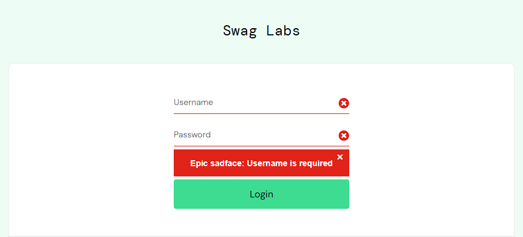
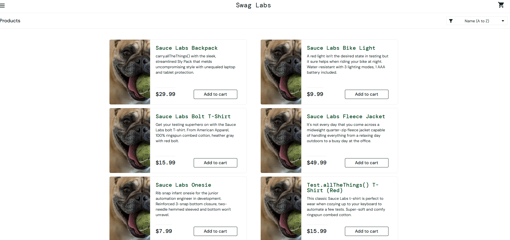

# Bug Reports – SauceDemo

The following bugs were identified during manual testing of SauceDemo. 
Test environment: Chrome browser.

---

## BUG-001: Locked-out user can’t login – correct error message displayed

**Severity:** Major  
**Priority:** High  

**Description:**  
Using `locked_out_user` credentials blocks access, but error is generic. The issued error is:  
> “Epic sadface: Sorry, this user has been locked out.”  

This is expected behavior; no defect identified.

**Screenshot:**


---

## BUG-002: Incorrect empty-field error message

**Severity:** Major  
**Priority:** High  

**Description:**  
When attempting login with both fields empty, the system shows:  
> “Epic sadface: Username is required”  

**Expected result:**  
> “Epic sadface: Username and Password are required.”  

**Steps to Reproduce:**  
1. Navigate to login page  
2. Click “Login” without entering credentials  

```text
Actual: “Username is required”
Expected: “Username and Password are required”
```
**Screenshot:**


---

## BUG-003: Inventory images are identical for `problem_user`

**Severity:** Major  
**Priority:** High  

**Description:**  
When logging in with the `problem_user` account, the inventory page displays the **same** product image for every item, making it impossible to distinguish between different products. This suggests a data mapping issue or placeholder image being reused.

**Steps to Reproduce:**  
1. Navigate to https://www.saucedemo.com  
2. Login with credentials:  
   - Username: `problem_user`  
   - Password: `secret_sauce`  
3. Observe the product images on the inventory page

**Expected Result:**  
Each product shows its own distinct image.

**Actual Result:**  
All products display an identical image (no variation).

**Screenshot:**


---

## BUG-004: Checkout form displays only first error at a time

**Severity:** Major  
**Priority:** Medium  

**Description:**  
During checkout, if multiple required fields are left empty, the system only displays the first missing field's error message. This limits the user’s visibility and requires multiple attempts to correct form input.

**Steps to Reproduce:**  
1. Login using valid credentials (`standard_user` / `secret_sauce`)  
2. Add any product to the cart  
3. Go to cart and click “Checkout”  
4. Leave **First Name**, **Last Name**, and **Postal Code** fields empty  
5. Click “Continue”

**Expected Result:**  
A combined error message should list all required fields or multiple messages should appear simultaneously.

**Actual Result:**  
Only one error is shown per submission (e.g., “Error: First Name is required”).

**Screenshot:**

